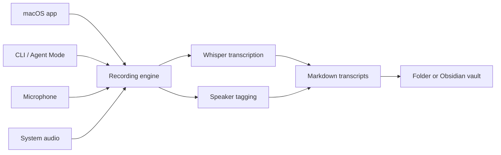
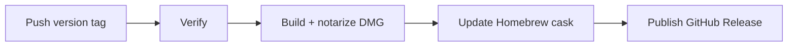

<p align="center">
  
</p>

<h1 align="center">Hover</h1>

<p align="center">
  Private, on-device transcription for macOS.<br>
  Capture system audio and microphone input, identify speakers, and save transcripts.
</p>

<p align="center">
  <a href="https://github.com/flyngaa/hover/releases/latest/download/Hover.dmg"></a>
</p>

<p align="center">
  <a href="https://github.com/flyngaa/hover/releases/latest"></a>
  
  
</p>

## Features

- Capture system audio, microphone input, or both.
- Transcribe locally and label speakers automatically.
- Save to any folder or directly into an Obsidian vault.
- Record from the macOS app, keyboard shortcuts, or the CLI.

## Install

### Download the DMG

Download the [latest `Hover.dmg`](https://github.com/flyngaa/hover/releases/latest/download/Hover.dmg).

### Homebrew

```bash
brew install --cask flyngaa/tap/hover
```

## Quick start

### macOS app

1. Choose **Microphone**, **System Audio**, or **Both** as the input source.
2. Turn speaker tagging on or off and choose where transcripts should be saved.
3. Start recording. Stop when you are finished; Hover completes speaker tagging and saves the transcript as Markdown.

The global shortcuts are <kbd>⌘6</kbd> to start and <kbd>⌘7</kbd> to stop. The moth in the menu bar turns red during a recording and brings Hover back to the front when clicked.

### CLI / Agent Mode

```bash
# Record for 30 seconds using the app's saved settings
hover record --duration 30

# Capture system audio and microphone, then tag speakers
hover record --source both --tag-speakers

# Save into a folder or a known Obsidian vault
hover record --output ~/Desktop
hover record --output "My Notes"

# Emit a machine-readable result
hover record --duration 30 --json
```

Omit `--duration` to record until you press <kbd>Ctrl-C</kbd>. The finished transcript is written to stdout; progress and diagnostics are written to stderr.

Model setup is also available without opening the app:

```bash
hover setup
hover setup --status
hover --help
```

## Compatibility

| Requirement | Support |
| --- | --- |
| Operating system | macOS 14.2 Sonoma or later |

## How Hover works

The app and CLI are two entry points into the same recording pipeline:



### Main components

| Component | Responsibility |
| --- | --- |
| SwiftUI app | Recording controls, model setup, settings, transcript library, and menu-bar presence |
| Agent Mode | Headless recording, setup, text output, and JSON output through the `hover` command |
| Audio Capture | Captures microphone audio with AVFoundation and system audio with a Core Audio process tap |
| Chunker | Ends a chunk on trailing silence or a hard time limit so transcription can progress during a recording |
| Transcriber | Writes temporary 16 kHz WAV chunks and runs `whisper-cli` locally |
| Speaker Tagging | Analyzes the complete recording and finds speaker turns |
| Speaker Attribution | Aligns timestamped transcript segments with detected speaker turns |
| Transcript Store | Saves, searches, renames, groups, moves, and deletes Markdown files |
| Output Destinations | Keeps transcripts in one selected folder, including discovered Obsidian vaults |

### Runtime technology

Release builds carry pinned native helpers; users do not need to install them separately.

| Dependency | Purpose | Release version |
| --- | --- | --- |
| [whisper.cpp](https://github.com/ggml-org/whisper.cpp) | On-device speech-to-text | v1.9.1 |
| [sherpa-onnx](https://github.com/k2-fsa/sherpa-onnx) | Offline speaker diarization | v1.13.4 |
| [ONNX Runtime](https://github.com/microsoft/onnxruntime) | Runs the speaker models | 1.27.0 |
| Whisper large-v3-turbo Q5 | Multilingual transcription model | Downloaded on first launch |
| Pyannote segmentation + NeMo TitaNet | Speaker segmentation and embeddings | Downloaded on first launch |

Models live under `~/Library/Application Support/Hover/models` in an installed release. They stay separate from the folder containing your transcripts.

## Development

### Requirements

- An Apple Silicon Mac running macOS 14.2 or later
- Xcode with Swift 6 support

Clone and build the canonical Xcode product graph:

```bash
git clone https://github.com/flyngaa/hover.git
cd hover
./build.sh
```

The Debug app is written to:

```text
.build/xcode-derived-data/Build/Products/Debug/Hover.app
```

Run the test suite with:

```bash
./test.sh
```

### Development helpers

Unlike a release app, a Debug build uses development helper locations. Install Whisper with:

```bash
brew install whisper-cpp
```

First-launch Model Setup stores development model data under `~/Documents/Transcripts/models`. Speaker tagging additionally looks for a Python environment at `~/Documents/Transcripts/models/diar-venv` containing `numpy` and `sherpa_onnx`. The release build does not use this Python fallback; it ships a native speaker-tagging helper.

## Contributing

Focused contributions are welcome:

1. Create a branch for one change.
2. Keep platform-specific work in `HoverPlatform` and domain logic in `HoverCore` where practical.
3. Add or update tests for behavior changes.
4. Run formatting, tests, and a local build.
5. Open a pull request describing the user-visible result and any tradeoffs.

Please avoid committing generated build products, downloaded models, or helper caches.

## Release process

Push a semantic-version tag to start a release:

```bash
git tag v1.2.3
git push origin v1.2.3
```



## Troubleshooting

| Problem | Solution |
| --- | --- |
| Microphone is unavailable | Enable Hover under **System Settings → Privacy & Security → Microphone**. |
| System audio is unavailable | Start a System Audio recording once. If access was refused, enable Hover under **Privacy & Security → Screen & System Audio Recording → System Audio Recording Only**. |
| Model setup failed | Check the network connection and retry, or run `hover setup`. |
| The `hover` command is missing | Use **Hover → Settings → Install CLI**, or reinstall the Homebrew cask. |
